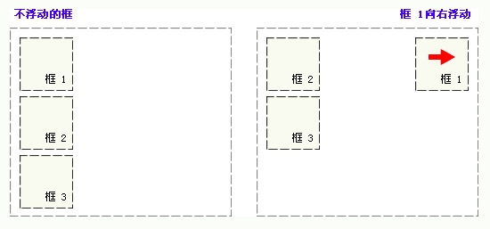
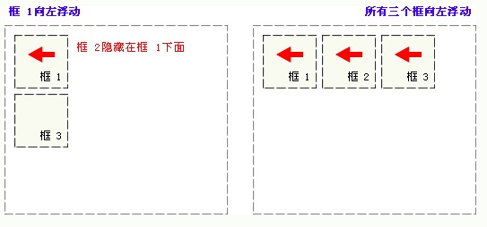
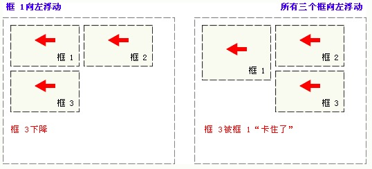

# 盒子模型（二）

## 文档流

原文是" normal flow "，也有人叫普通流、正常流，指将窗体自上而下分成若干行，并在每行中按从左至右的依次排放元素，这是传统HTML文档的文本布局。  

 网页中大部分对象默认是占用文档流，也有一些对象是不占文档流的，比如表单中隐藏域。  

---

## 脱离文档流

当然我们也可以让占用文档流的元素转换成不占文档流，浮动( float )、绝对定位( absolute )、固定定位( fixed ) 三种方式定位会脱离文档流。  

---

## 浮动

### 1. 浮动元素不占据文档流

虽然在在本质上，浮动元素已经脱离文档流了，但是在展示的时候，还是会占据文档流的内容空间。原因是，浮动元素是以行内块元素展示，并且不受 display 属性影响，但是文档上又不占据父元素空间，因此会看到子元素浮动后父元素坍塌，高度为 0 的情况。所以，这叫文档流上不占据空间，但是占用行内元素空间。  

例：
**HTML**:

```html
    <div class="father">
        这是父元素。
        <div class="left">布局向左浮动。</div>
        <div class="right">布局向右浮动。</div>
    </div>
```

**CSS**:

```css
.father{
    border: 5px solid brown;
    background-color: antiquewhite;
}

.left{
    float: left;
    width: 100px;
    height: 100px;
    border: 2px solid rgb(150, 134, 114);
    background-color: bisque;
}

.right{
    float: right;
    width: 150px;
    height: 150px;
    border: 2px solid rgb(124, 103, 75);
    background-color: burlywood;
}
```

### 2. 浮动元素占据其前后行内元素的空间

假设浮动元素的前一个元素是一个行内元素，浮动元素就会侵占行内的空间，尽可能的靠近父元素文档开始的位置。如果之后的元素在宽度上满足不了，将会被挤出父元素框，在浮动元素下方重新排列。  

例：  
**HTML**:

```html
<div class="father">
    <span class="inline">这是行内元素。</span>
    <div class="left">布局向左浮动。</div>
    <div class="lleft">布局也向左浮动。</div>
</div>
```

**CSS**:

```css
.father{
    height: 600px;
    border: 5px solid brown;
    background-color: antiquewhite;
}

.inline{
    margin: 5px;
    border: 10px solid rgb(255, 153, 0);
}

.left{
    float: left;
    width: 200px;
    height: 200px;
    border: 2px solid rgb(150, 134, 114);
    background-color: bisque;
}

.lleft{
    float: left;
    width: 300px;
    height: 300px;
    border: 2px solid rgb(124, 103, 75);
    background-color: burlywood;
}
```

### 3. 浮动后面元素可以接浮动元素

这句话就不用解释了，因为是行内元素的展示方式，因此，同一父级下依次按照浮动要求排列。（见上例）  

接下来的几张图可以结合上述特点理解。  







---

## position

position 的定义：检索对象的定位方式。共有5个取值。  

### 1. static

默认值，无特殊（静态）定位。对象遵循HTML定位规则 。  

### 2. absolute

绝对定位。将对象从文档流中拖出，使用left，right，top，bottom 等属性相对于其最接近的一个具有定位设置的父对象进行绝对定位。如果不存在这样的父对象，则依据 body 对象。（相对“最近”“开启定位”的父元素/祖先元素定位，如果它的父元素/祖先元素都没“开启定位”，那么就相对 html 定位）  

绝对定位元素可层叠，层叠顺序可通过 z-index 属性控制，z-index 值为无单位的整数，大的在上面，可以有负值。  

例：

**HTML**:

```html
<div class="grand">
    祖先元素，开启定位
    <div class="parent">
        父元素，未开启定位
        <div class="child1">子元素，定位为absolute</div>
        <div class="child2">另一个子元素</div>
    </div>
</div>
```

**CSS**:

```css
.grand {
    position: relative;

    width: 400px;
    height: 400px;
    margin: 10px;
    background-color: rgb(26, 90, 26);
}
.parent {
    width: 250px;
    height: 250px;
    background-color: rgb(41, 150, 41);
}
.child1 {
    position: absolute;
    bottom: 0;
    right: 0;

    width: 100px;
    height: 100px;
    background-color: rgb(120, 172, 71);
    z-index: 2;
}

.child2{
    position: absolute;
    bottom: 0;
    right: 80px;

    width: 100px;
    height: 100px;
    background-color: rgb(98, 141, 58);
}
```

### 3. fixed

固定定位。元素的位置相对于浏览器窗口是固定位置。即使窗口是滚动的它也不会移动。 

例：

**HTML**:

```html
<div class="normal">未开启定位</div>
<div class="fixed">定位为fixed</div>
```

**CSS**:

```css
body{
    height: 1000px;
}

.normal{
    width: 300px;
    height: 200px;
    margin: 10px;
    background-color: cadetblue;
}

.fixed{
    position: fixed;
    top: 0px;
    right: 0px;

    width: 100px;
    height: 100px;
    background-color: greenyellow;
}
```

### 4. relative

相对定位。对象不可层叠，(未脱离正常文档流，即使相对定位元素的内容是移动，预留空间的元素仍保存在正常流动。)但将依据 left，right，top，bottom 等属性在正常文档流中偏移位置。  

例：  

**HTML**:

```html
<div class="relative">定位为relative</div>
<div class="normal">未开启定位</div>
```

**CSS**:

```css
.relative{
    position: relative;
    left: 350px;

    width: 150px;
    height: 150px;
    background-color: darkseagreen;
}

.normal{
    width: 300px;
    height: 200px;
    margin: 10px;
    background-color: cadetblue;
}
```

### 5. sticky

sticky跟前面四个属性值都不一样，它会产生动态效果，很像relative和fixed的结合：一些时候是relative定位（定位基点是自身默认位置），另一些时候自动变成fixed定位（定位基点是视口）。  
因此，它能够形成"动态固定"的效果。比如，网页的搜索工具栏，初始加载时在自己的默认位置（relative定位）。  

例：bilibili的搜索栏


---