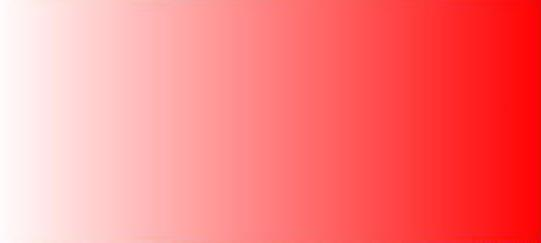

# CSS 动态设计

## 函数

[CSS函数](https://blog.csdn.net/MFWSCQ/article/details/89530967)

### 1. attr()

定义及作用：返回选择元素的属性值;特别是用在伪元素上时获取的是伪元素对应原始元素的属性
```css
attr(attribute-name)   //attribute-name为html元素的属性值，必填项
```
例子
```css
a:after {content: " (" attr(href) ")";}
<a href="#">点击</a>
```

### 2. calc()

定义：

calc()是css3新增的一个css计算函数，它是单词calculate的缩写，意思是计算；它能计算什么呢？包括border，padding，margin，font-size,widht,height等涉及数量运算的动态计算都可以用。举个简单的例子：
```css
.box{
    height:calc(100vh + 1px)；
    width:calc(100% - 10rem);
    padding-bottom:calc(5px * 3 / 2)
}
```
在上面例子中，calc函数会自动计算出满屏的高度，然后加上1px，得出来的就是.box的高度。是不是很方便？

calc能支持的单位包括：em,rem,px,vh,vw和百分比等css里面的常见的长度单位，

calc能支持的数学运算符包括+，-，*，/ 等多个单位，不过要注意的是，在写的时候要在**运算符前后都加上一个空格**。

### 3. 背景图片函数

linear-gradient()
*radial-gradient() 
*repeating-linear-gradient() 
*repeating-radial-gradient() 
带 \* 号的自行了解


**linear-gradient()**
函数用于创建一个线性渐变的 "图像"。

为了创建一个线性渐变，你需要设置一个起始点和一个方向（指定为一个角度）的渐变效果。你还要定义终止色。终止色就是你想让Gecko去平滑的过渡，并且你必须指定至少两种，当然也会可以指定更多的颜色去创建更复杂的渐变效果。

语法:
```css
background: linear-gradient(direction, color-stop1, color-stop2, ...);
```
 例子:

 从上到下
 ```html
<!DOCTYPE html>
<html>
<head>
<meta charset="utf-8"> 
<style>
#grad1 {
    height: 200px;
    background: -webkit-linear-gradient(red,yellow,blue); /* Safari 5.1 to 6.0 */
    background: -o-linear-gradient(red,yellow,blue); /* Opera 11.1 to 12.0 */
    background: -moz-linear-gradient(red,yellow,blue); /* Firefox 3.6 to 15 */
    background: linear-gradient(red,yellow,blue); /* 标准语法 (必须在最后) */
}
</style>
</head>

<body>
<div id="grad1"></div>
</body>
</html>
 ```

 从左到右,从其他方向同理
 ```html

<!DOCTYPE html>
<html>
<head>
<meta charset="utf-8"> 

<style>
#grad1 {
    height: 200px;
    background: -webkit-linear-gradient(left, red , blue); /* Safari 5.1 - 6.0 */
    background: -o-linear-gradient(right, red, blue); /* Opera 11.1 - 12.0 */
    background: -moz-linear-gradient(right, red, blue); /* Firefox 3.6 - 15 */
    background: linear-gradient(to right, red , blue); /* 标准的语法（必须放在最后） */
}
</style>
</head>
<body>

<div id="grad1"></div>
</body>
</html>
 ```

线性渐变指定角度
 ```html
<!DOCTYPE html>
<html>
<head>
<meta charset="utf-8"> 

<style>
#grad1 {
    height: 100px;
    background: -webkit-linear-gradient(0deg, red, blue); /* Safari 5.1 - 6.0 */
    background: -o-linear-gradient(0deg, red, blue); /* Opera 11.1 - 12.0 */
    background: -moz-linear-gradient(0deg, red, blue); /* Firefox 3.6 - 15 */
    background: linear-gradient(0deg, red, blue); /* 标准的语法（必须放在最后） */
}

#grad2 {
    height: 100px;
    background: -webkit-linear-gradient(90deg, red, blue); /* Safari 5.1 - 6.0 */
    background: -o-linear-gradient(90deg, red, blue); /* Opera 11.1 - 12.0 */
    background: -moz-linear-gradient(90deg, red, blue); /* Firefox 3.6 - 15 */
    background: linear-gradient(90deg, red, blue); /* 标准的语法（必须放在最后） */
}

#grad3 {
    height: 100px;
    background: -webkit-linear-gradient(180deg, red, blue); /* Safari 5.1 - 6.0 */
    background: -o-linear-gradient(180deg, red, blue); /* Opera 11.1 - 12.0 */
    background: -moz-linear-gradient(180deg, red, blue); /* Firefox 3.6 - 15 */
    background: linear-gradient(180deg, red, blue); /* 标准的语法（必须放在最后） */
}

#grad4 {
    height: 100px;
    background: -webkit-linear-gradient(-90deg, red, blue); /* Safari 5.1 - 6.0 */
    background: -o-linear-gradient(-90deg, red, blue); /* Opera 11.1 - 12.0 */
    background: -moz-linear-gradient(-90deg, red, blue); /* Firefox 3.6 - 15 */
    background: linear-gradient(-90deg, red, blue); /* 标准的语法（必须放在最后） */
}
</style>
</head>
<body>
<div id="grad1" style="color:white;text-align:center;">0deg</div><br>
<div id="grad2" style="color:white;text-align:center;">90deg</div><br>
<div id="grad3" style="color:white;text-align:center;">180deg</div><br>
<div id="grad4" style="color:white;text-align:center;">-90deg</div>
</body>
</html>

 ```

 思考:运用透明度做出以下图片

 

