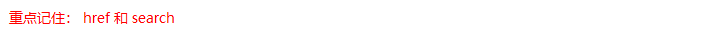

#  BOM

### 1.什么是BOM

​	BOM（Browser Object Model）即浏览器对象模型，它提供了独立于内容而与浏览器窗口进行交互的对象，其核心对象是 window。

​	BOM 由一系列相关的对象构成，并且每个对象都提供了很多方法与属性。

​	BOM 缺乏标准，JavaScript 语法的标准化组织是 ECMA，DOM 的标准化组织是 W3C，BOM 最初是Netscape 浏览器标准的一部分。


### 2. BOM的构成

BOM 比 DOM 更大，它包含 DOM。


### 3. 顶级对象window


### 4. window对象的常见事件

#### 页面（窗口）加载事件（2种）

**第1种**


window.onload 是窗口 (页面）加载事件，**当文档内容完全加载完成**会触发该事件(包括图像、脚本文件、CSS 文件等), 就调用的处理函数。


**第2种**


​	DOMContentLoaded 事件触发时，仅当DOM加载完成，不包括样式表，图片，flash等等。

​	IE9以上才支持！！！

​	如果页面的图片很多的话, 从用户访问到onload触发可能需要较长的时间, 交互效果就不能实现，必然影响用户的体验，此时用 DOMContentLoaded 事件比较合适。

```js
    <script>
        window.addEventListener('load', function() {
            var btn = document.querySelector('button');
            btn.addEventListener('click', function() {
                alert('点击我');
            })
        })
        window.addEventListener('load', function() {
            alert(22);
        })
        document.addEventListener('DOMContentLoaded', function() {
            alert(33);
        })
    </script>
```

#### 调整窗口大小事件


​	window.onresize 是调整窗口大小加载事件,  当触发时就调用的处理函数。

注意：

1. 只要窗口大小发生像素变化，就会触发这个事件。

2. 我们经常利用这个事件完成响应式布局。 window.innerWidth 当前屏幕的宽度

```js
    <script>
        // 注册页面加载事件
        window.addEventListener('load', function() {
            var div = document.querySelector('div');
        	// 注册调整窗口大小事件
            window.addEventListener('resize', function() {
                // window.innerWidth 获取窗口大小
                console.log('变化了');
                if (window.innerWidth <= 800) {
                    div.style.display = 'none';
                } else {
                    div.style.display = 'block';
                }
            })
        })
    </script>
    <div></div>
```


### 2. 定时器（两种）

window 对象给我们提供了 2 个非常好用的方法-定时器。

- setTimeout() 

- setInterval()  

#### setTimeout() 炸弹定时器

##### 开启定时器


> ```
> 普通函数是按照代码顺序直接调用。
> 
> 简单理解： 回调，就是回头调用的意思。上一件事干完，再回头再调用这个函数。
> 例如：定时器中的调用函数，事件处理函数，也是回调函数。
> 
> 以前我们讲的   element.onclick = function(){}   或者  element.addEventListener(“click”, fn);   里面的 函数也是回调函数。
> 
> ```


```js
    <script>
        // 回调函数是一个匿名函数
         setTimeout(function() {
             console.log('时间到了');

         }, 2000);
        function callback() {
            console.log('爆炸了');
        }
		// 回调函数是一个有名函数
        var timer1 = setTimeout(callback, 3000);
        var timer2 = setTimeout(callback, 5000);
    </script>
```


##### 停止定时器


```js
    <button>点击停止定时器</button>
    <script>
        var btn = document.querySelector('button');
		// 开启定时器
        var timer = setTimeout(function() {
            console.log('爆炸了');
        }, 5000);
		// 给按钮注册单击事件
        btn.addEventListener('click', function() {
            // 停止定时器
            clearTimeout(timer);
        })
    </script>
```


#### setInterval() 闹钟定时器

##### 开启定时器


```js
    <script>
        // 1. setInterval 
        setInterval(function() {
            console.log('继续输出');
        }, 1000);
    </script>
```


##### 停止定时器


#### 案例：发送短信倒计时

​	点击按钮后，该按钮60秒之内不能再次点击，防止重复发送短信。


```js
    手机号码： <input type="number"> <button>发送</button>
    <script>
        var btn = document.querySelector('button');
		// 全局变量，定义剩下的秒数
        var time = 3; 
		// 注册单击事件
        btn.addEventListener('click', function() {
            // 禁用按钮
            btn.disabled = true;
            // 开启定时器
            var timer = setInterval(function() {
                // 判断剩余秒数
                if (time == 0) {
                    // 清除定时器和复原按钮
                    clearInterval(timer);
                    btn.disabled = false;
                    btn.innerHTML = '发送';
                } else {
                    btn.innerHTML = '还剩下' + time + '秒';
                    time--;
                }
            }, 1000);
        });
    </script>
```


### 3. location对象

#### 什么是 location 对象


#### URL


#### location 对象的属性




#### 案例：5分钟自动跳转页面


```js
    <button>点击</button>
    <div></div>
    <script>
        var btn = document.querySelector('button');
        var div = document.querySelector('div');
        btn.addEventListener('click', function() {
            // console.log(location.href);
            location.href = 'http://www.itcast.cn';
        })
        var timer = 5;
        setInterval(function() {
            if (timer == 0) {
                location.href = 'http://www.itcast.cn';
            } else {
                div.innerHTML = '您将在' + timer + '秒钟之后跳转到首页';
                timer--;
            }
        }, 1000);
    </script>
```

#### 案例：获取URL参数


```js
    <div></div>
	<script>
        console.log(location.search); // ?uname=andy
        // 1.先去掉？  substr('起始的位置'，截取几个字符);
        var params = location.search.substr(1); // uname=andy
        console.log(params);
        // 2. 利用=把字符串分割为数组 split('=');
        var arr = params.split('=');
        console.log(arr); // ["uname", "ANDY"]
        var div = document.querySelector('div');
        // 3.把数据写入div中
        div.innerHTML = arr[1] + '欢迎您';
    </script>
```

#### location对象的常见方法


```js
    <button>点击</button>
    <script>
        var btn = document.querySelector('button');
        btn.addEventListener('click', function() {
            // 记录浏览历史，所以可以实现后退功能
            // location.assign('http://www.itcast.cn');
            // 不记录浏览历史，所以不可以实现后退功能
            // location.replace('http://www.itcast.cn');
            location.reload(true);
        })
    </script>
```

### 4. navigator对象

​	navigator 对象包含有关浏览器的信息，它有很多属性，我们最常用的是 userAgent，该属性可以返回由客户机发送服务器的 user-agent 头部的值。

下面前端代码可以判断用户那个终端打开页面，实现跳转

```js
if((navigator.userAgent.match(/(phone|pad|pod|iPhone|iPod|ios|iPad|Android|Mobile|BlackBerry|IEMobile|MQQBrowser|JUC|Fennec|wOSBrowser|BrowserNG|WebOS|Symbian|Windows Phone)/i))) {
    window.location.href = "";     //手机
 } else {
    window.location.href = "";     //电脑
 }
```

### 5. history对象

​	window对象给我们提供了一个 history对象，与浏览器历史记录进行交互。该对象包含用户（在浏览器窗口中）访问过的URL。


history对象一般在实际开发中比较少用，但是会在一些 OA 办公系统中见到。


###  6. Cookie

#### 6.1 什么是 Cookie？
Cookie 是一些数据, 存储于你电脑上的文本文件中。

当 web 服务器向浏览器发送 web 页面时，在连接关闭后，服务端不会记录用户的信息。

Cookie 的作用就是用于解决 "如何记录客户端的用户信息":
* 当用户访问 web 页面时，他的名字可以记录在 cookie 中。
* 在用户下一次访问该页面时，可以在 cookie 中读取用户访问记录。
Cookie 以名/值对形式存储，如下所示:
```js
username=John Doe
```
当浏览器从服务器上请求 web 页面时， 属于该页面的 cookie 会被添加到该请求中。服务端通过这种方式来获取用户的信息。

#### 使用 JavaScript 创建Cookie
JavaScript 可以使用 document.cookie 属性来创建 、读取、及删除 cookie。

JavaScript 中，创建 cookie 如下所示：
```js
document.cookie="username=John Doe";
```
您还可以为 cookie 添加一个过期时间（以 UTC 或 GMT 时间）。默认情况下，cookie 在浏览器关闭时删除：
```js
document.cookie="username=John Doe; expires=Thu, 18 Dec 2043 12:00:00 GMT";
```
您可以使用 path 参数告诉浏览器 cookie 的路径。默认情况下，cookie 属于当前页面。
```js
document.cookie="username=John Doe; expires=Thu, 18 Dec 2043 12:00:00 GMT; path=/";
```
#### 使用 JavaScript 读取 Cookie
在 JavaScript 中, 可以使用以下代码来读取 cookie：
```js
var x = document.cookie;
```
#### 使用 JavaScript 修改 Cookie
在 JavaScript 中，修改 cookie 类似于创建 cookie，如下所示：
```js
document.cookie="username=John Smith; expires=Thu, 18 Dec 2043 12:00:00 GMT; path=/";
```
旧的 cookie 将被覆盖。

#### 使用 JavaScript 删除 Cookie
删除 cookie 非常简单。只需要设置 expires 参数为以前的时间即可，如下所示，设置为 Thu, 01 Jan 1970 00:00:00 GMT:
```js
document.cookie = "username=; expires=Thu, 01 Jan 1970 00:00:00 GMT";
```
注意，当删除时不必指定 cookie 的值。

函数
```js
//设置 cookie 值的函数
function setCookie(cname,cvalue,exdays){
    var d = new Date();
    d.setTime(d.getTime()+(exdays*24*60*60*1000));
    var expires = "expires="+d.toGMTString();
    document.cookie = cname+"="+cvalue+"; "+expires;
}

//获取 cookie 值的函数
function getCookie(cname){
    var name = cname + "=";
    var ca = document.cookie.split(';');
    for(var i=0; i<ca.length; i++) {
        var c = ca[i].trim();
        if (c.indexOf(name)==0) { return c.substring(name.length,c.length); }
    }
    return "";
}

//检测 cookie 值的函数
function checkCookie(){
    var user=getCookie("username");
    if (user!=""){
        alert("欢迎 " + user + " 再次访问");
    }
    else {
        user = prompt("请输入你的名字:","");
          if (user!="" && user!=null){
            setCookie("username",user,30);
        }
    }
}
```


### 7. 本地存储

随着互联网的快速发展，基于网页的应用越来越普遍，同时也变的越来越复杂，为了满足各种各样的需求，会经常性在本地存储大量的数据，HTML5规范提出了相关解决方案。

#### 7.1.本地存储特性

1、数据存储在用户浏览器中

2、设置、读取方便、甚至页面刷新不丢失数据

3、容量较大，sessionStorage约5M、localStorage约20M

4、只能存储字符串，可以将对象JSON.stringify() 编码后存储

#### 7.2.window.sessionStorage

1、生命周期为关闭浏览器窗口

2、在同一个窗口(页面)下数据可以共享

3、以键值对的形式存储使用

存储数据：

```javascript
sessionStorage.setItem(key, value)
```

获取数据：

```javascript
sessionStorage.getItem(key)
```

删除数据：

```javascript
sessionStorage.removeItem(key)
```

清空数据：(所有都清除掉)

```javascript
sessionStorage.clear()
```

#### 7.3.window.localStorage

1、声明周期永久生效，除非手动删除 否则关闭页面也会存在

2、可以多窗口（页面）共享（同一浏览器可以共享）

3.  以键值对的形式存储使用

存储数据：

```javascript
localStorage.setItem(key, value)
```

获取数据：

```javascript
localStorage.getItem(key)
```

删除数据：

```javascript
localStorage.removeItem(key)
```

清空数据：(所有都清除掉)

```javascript
localStorage.clear()
```

#### 7.4.案例：记住用户名

如果勾选记住用户名， 下次用户打开浏览器，就在文本框里面自动显示上次登录的用户名

##### 案例分析

1. 把数据存起来，用到本地存储

2. 关闭页面，也可以显示用户名，所以用到localStorage

3. 打开页面，先判断是否有这个用户名，如果有，就在表单里面显示用户名，并且勾选复选框

4. 当复选框发生改变的时候change事件

5. 如果勾选，就存储，否则就移除

   .jpg)