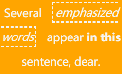
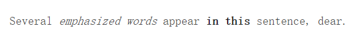
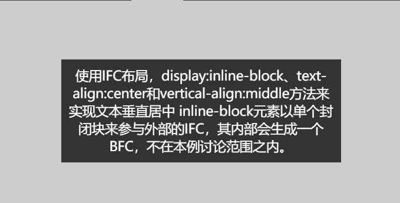
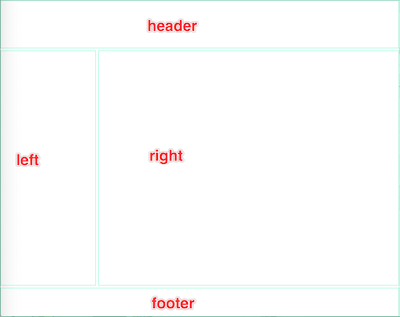
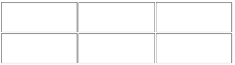
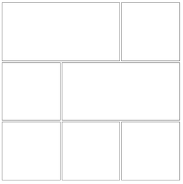
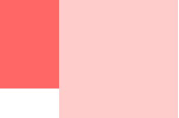

# 排版上下文(FC)

## 1. 块级排版上下文(BFC)

### 1.1 BFC 定义

BFC(Block formatting context)直译为"块级格式化上下文"。它是一个独立的渲染区域，只有Block-level box（块级元素）参与， 它规定了内部的Block-level Box如何布局，并且与这个区域外部毫不相干.

通俗地来说：创建了 BFC的元素就是一个独立的盒子，里面的子元素不会在布局上
影响外面的元素（里面怎么布局都不会影响外部），BFC任然属于文档中的普通流

### 1.2BFC的生成

知道了BFC怎么触发BFC
满足以下条件之一都可以触发BFC，变身为BFC

1. 根元素
2. float属性不为none
3. position不为static和relative
4. overflow不为visible
5. display为inline-block, table-cell, table-caption, flex, inline-flex

> 你会发现BFC无处不在，只是自己用的时候不知道而已

### 1.3 BFC布局规则

变身为BFC后有什么特性呢，以下：

1. 内部的Box会在垂直方向，一个接一个地放置。
2. Box垂直方向的距离由margin决定。属于同一个BFC的两个相邻Box的margin会发生重叠
3. 每个元素的margin box的左边， 与包含块border box的左边相接触(对于从左往右的格式化，否则相反)。即使存在浮动也是如此。
4. BFC的区域不会与float box重叠。
5. BFC就是页面上的一个隔离的独立容器，容器里面的子元素不会影响到外面的元素。反之也如此。
6. 计算BFC的高度时，浮动元素也参与计算

### 1.4 BFC作用

#### 1.4.1 防止外边距重叠

bfc导致的属于同一个bfc中的子元素的margin重叠(Box垂直方向的距离由margin决定。属于同一个BFC的两个相邻Box的margin会发生重叠)

问题：由图可以看到，String1和String2 之间只有20px的margin，按理来说应该是40px，但这是在bfc中导致了他们的margin重叠

        
String1

        
String2

代码：

~~~html

        
String1

        
String2

~~~

解决方法：我们可以在div外面包裹一层容器，并触发该容器生成一个BFC。那么两个div便不属于同一个BFC，就不会发生margin重叠了。

        
String1

        

String2

代码：

~~~html

        
String1

        

String2

~~~

#### 1.4.2 清除浮动

问题：当元素的子元素都浮动后，会出现高度坍塌的现象，即父容器的高度不会被撑开

        

        

代码：

~~~html

        

        

~~~

解决方法：

bfc的规则：计算BFC的高度时，浮动元素也参与计算所以只要将父容器设置为bfc就可以把子元素包含进去：
这个容器将包含浮动的子元素，它的高度将扩展到可以包含它的子元素，在这个BFC，这些元素将会回到页面的常规文档流。

        

        

代码：

~~~html
.pre2{
        width: 200px;
        border: 2px solid red;
        /* 设置overflow*/
        overflow:hidden;
    }
~~~

#### 1.4.3 解决布局：防止文字环绕

        

        
sdfadsfdff fffffffds fsfffff sfd  fsdsdfsdf fffffff

代码：

~~~html

        

        
sdfadsfdff fffffffds fsfffff sfd  fsdsdfsdf fffffff

~~~

这个p元素并没有移动，但是它却出现在浮动元素的下方。p元素的line boxes（指的是文本行）进行了移位。此处line boxes的水平收缩为浮动元素提供了空间。

> bfc的规则：每个元素的margin box的左边， 与包含块border box的左边相接触(对于从左往右的格式化，否则相反)。即使存在浮动也是如此。

解决这个问题只要将p元素添加overflow：hidden使其成为一个新的bfc就可以了

        

        
sdfadsfdff fffffffds fsfffff sfd  fsdsdfsdf fffffff

## 2. 内联排版上下文([IFC])

### 2.1 IFC定义

IFC(Inline Formatting Contexts)即内联排版上下文，也可称为内联格式化上下文。用来规定内联级盒子的格式化规则。

* 符合以下条件即会生成一个IFC

    块级元素中仅包含内联级别元素

形成条件非常简单，需要注意的是当IFC中有块级元素插入时，会产生两个匿名块将父元素分割开来，产生两个IFC，这里不做过多介绍。

### 2.2 IFC布局规则

1. 内部的Boxes会在水平方向，一个接一个地放置。
2. 这些Boxes垂直方向的起点从包含块盒子的顶部开始。
3. 摆放这些Boxes的时候，它们在水平方向上的外边距、边框、内边距所占用的空间都会被考虑在内。
4. 在垂直方向上，这些框可能会以不同形式来对齐（vertical-align）：它们可能会使用底部或顶部对齐，也可能通过其内部的文本基线（baseline）对齐。
5. 能把在一行上的框都完全包含进去的一个矩形区域，被称为该行的行框（line box）。行框的宽度是由包含块（containing box）和存在的浮动来决定。
6. IFC中的line box一般左右边都贴紧其包含块，但是会因为float元素的存在发生变化。float元素会位于IFC与与line box之间，使得line box宽度缩短。
7. IFC中的line box高度由CSS行高计算规则来确定，同个IFC下的多个line box高度可能会不同（比如一行包含了较高的图片，而另一行只有文本）。
8. 当inline-level boxes的总宽度少于包含它们的line box时，其水平渲染规则由‘text-align’属性来确定，如果取值为‘justify’，那么浏览器会对inline-boxes（注意不是inline-table 和 inline-block boxes）中的文字和空格做出拉伸。
9. 当一个inline box超过line box的宽度时，它会被分割成多个boxes，这些boxes被分布在多个line box里。如果一个inline box不能被分割（比如只包含单个字符，或word-breaking机制被禁用，或该行内框受white-space属性值为nowrap或pre的影响），那么这个inline box将溢出这个line box。

> 上面的术语可能会看得有点迷糊，一会儿inline box，一会儿line box。line box是**行框**，inline box是**行内框**（或称为**内联框**），我们可简单按字面意思来理解：行内框是包含在行框内（或多个行框内，当出现换行时）的。

### 2.3 何时会生成IFC

和BFC可以被元素属性触发而被创建（triggered）不同，IFC只有在一个块元素中仅包含内联级别元素时才会生成。  
下面我们通过一个实例来看看行内框的构造：

~~~html

<body>

Several <em>emphasized words</em> appear
    <strong>in this</strong> sentence, dear.

</body>
~~~

p 元素产生一个块框，它包含了五个行内框，其中的三个是匿名的：

1. 匿名：”Several”
2. EM: “emphasized words”
3. 匿名：”appear”
4. STRONG: “in this”
5. 匿名：”sentence, dear.”

为了格式化这个段落，用户代理将这五个框排入行框内。本例中，为 p 元素生成的框生成了行内框的包含块。如果该包含块足够宽，则所有的行内框将放在一个行框内：

否则inline box将产生分割，来放置在多个行框内。如上例中Result面板中所示，这个段落被分布在3个行框中。您可以在上例中修改p元素的width来查看不同的格式化效果。

上例中，em元素被分割成2块（我们把它们称为“split1”和“split2”），margin、padding、border和text-decoration属性将不在分割处产生视觉效果，也就是在split1之后和split2之前无效。
回过来看上面的例子中这些属性的影响：

* margin 会被插入到 "emphasized" 之前和 "words" 之后。
* padding 会被插入到 "emphasized" 的前面和上下，以及 "words" 的后面和上下。
* border 将绘制在 "emphasized" 的前面和上下，以及 "words" 的后面和上下。

### 2.4 IFC有什么用途

使用IFC布局规则4和8可以实现文本垂直和水平居中：

~~~html

<body>

    
使用IFC布局，display:inline-block、text-align:center和vertical-align:middle方法来实现文本垂直居中 inline-block元素以单个封闭块来参与外部的IFC，其内部会生成一个BFC，不在本例讨论范围之内。
    

</body>
~~~

* 我们使用一个块元素来包含一个内联元素，这样会生成一个IFC来规定如何渲染行内元素。按照IFC行内框的布局规则，其水平位置将由text-align属性来确定，所以设置text-align:center将把行内框居中。
* 外部块元素的行高为内部行框设定了最小高度，好比在渲染时以一个隐藏的0宽度字符开始，具备该块元素所设置的行高（本例中为300px）和字体属性，我们称之为是一个支架（strut），作用是把外部块元素撑起来。参考阅读W3规范：[Strut]。
* 然后我们设置内联（或内联块）元素的垂直对齐属性为中间，它将参照前述的隐藏支架的baseline来对齐。如果我们把块元素的字体设置为0，实际效果就是内联元素被垂直居中放置在块元素中。

来几个例子？

* 上下间距不生效

    文本一
    文本二

代码：

~~~html

    文本一
    文本二

~~~

* 多个元素水平居中
水平排列规则根据IFC容器的text-align值来排列，可以用来实现多个子元素的水平居中。

    文本一
    文本二

代码：

~~~html

    文本一
    文本二

~~~

* float元素优先排列

    这是文本1
    这是文本2
    这是文本3
    这是文本4

> "这是文本3"优先排列

代码：

~~~html

    这是文本1
    这是文本2
    这是文本3
    这是文本4

~~~

### 2.5 行高计算

用户代理（user agent）将行内级框排入垂直堆叠的行框内。行框的高度由下面步骤决定：

1. 计算行框里的各行内级框的高度。对于置换元素、行内块元素、行内表格元素来说，这是边界框的高度，对于行内框来说，这是其‘line-height’。
2. 行内级元素根据其‘vertical-align’属性垂直对齐。如果这些框使用‘top’或‘bottom’对齐，用户代理必须以最小化行框的高为目标对齐这些框。这可能存在多种对齐方案，CSS 2.1并不定义行框基线的位置（也就是前述strut的位置）。
3. 行框的高是最顶端框的顶边到最底端框的底边的距离。

>空的行内元素产生空的行内框，但是这些框仍然拥有margins, padding, borders 和一个line height, 所以在上述行高计算中和有内容的行内元素一样。

*行距（Leading）和半行距（half-leading）*
CSS 假设所有字体的度量都有基线以上的height和基线以下的depth，我们使用 **A（ascender）** 来表示这个height（字母高出基线部分），而用 **D（descender）** 来表示depth（字母低出基线部分）。

同时我们定义 **AD** = **A** + **D**，也就是整个字母的高度。

User agent 必须在一个非替换行内框中按照字符（glyphs）的基线对它们进行对齐。也就是确定 **A** 和 **D**。 某元素中的字符可能存在多个字体，**A** 和 **D**则不尽相同。如果这个行内框不包含任何字符，它被认为包含一个strut（一个0宽度的隐藏字符），这个隐藏字符的 **A** 和 **D**遵循该元素的第一个有效字体。

## 3. 网格排版上下文(GFC)

>由于布局规则及内容过于繁琐，所以在此仅将其与其他对比进行讲解

指路知乎[GFC] 可查看详细参数及技术内容

### 3.1 GFC（GrideLayout formatting contexts）

直译为"网格布局格式化上下文"（也即是新的布局：display:grid;兼容性问题比较大），当为一个元素设置display值为grid的时候，此元素将会获得一个独立的渲染区域，我们可以通过在网格容器（grid container）上定义网格定义行（grid definition rows）和网格定义列（grid definition columns）属性各在网格项目（grid item）上定义网格行（grid row）和网格列（grid columns）为每一个网格项目（grid item）定义位置和空间。

GFC将改变传统的布局模式，他将让布局从一维布局变成了二维布局。简单的说，有了GFC之后，布局不再局限于单个维度了。这个时候你要实现类似九宫格，拼图之类的布局效果显得格外的容易。

### 3.2 设置条件

display属性值设置为为“grid”或者“inline-grid”的容器

### 3.3 经典 VS GFC

#### 3.3.1 经典布局

CSS

~~~css
.warp {
    height: 100%;
    display: grid;
    grid-template-columns: 200px calc(100% - 205px);
    grid-template-rows: 100px calc(100% - 170px) 60px;
    grid-gap: 5px;
}
.warp div { border: 1px solid aquamarine; }
.warp .g-1 { grid-column-start: 1; grid-column-end: 3; }
.warp .g-4 { grid-column-start: 1; grid-column-end: 3; }
~~~

html

~~~html

    

    

    

    

~~~

经典效果展示

  

#### 3.3.2 GFC实现布局

CSS

~~~css
.list {
    display: grid;
    grid-template-columns: repeat(3, 1fr);
    grid-template-rows: auto;  
    grid-column-gap: 2px;
    grid-row-gap: 2px;
    width: 400px;
}
.list div { height: 50px; border: 1px solid grey; }
~~~

html

~~~html

    

    

    

    

    

    

~~~

GFC 效果示意

显然通过GFC控制排列，代码量也非常的少，也很容易理解。

#### 3.3.3 GFC 任意魔方拼接

通过任意魔方拼接的实例更进一步认识GFC的优势

CSS

~~~css
.cube {
    display: grid;
    grid-gap: 2px;
    width: 300px; height: 300px;
}
.cube div {
    border: 1px solid grey;
}
.cube .g-1 {
    grid-column-start: 1; grid-column-end: 3;
}
.cube .g-3 {
    grid-column-start: 2;
    grid-column-end: 4;
    grid-row-start: 2;
    grid-row-end: 3;
}
~~~

html

~~~html

    

    

    

    

    

    

    

~~~

效果展示

### 3.4 总结

部分问题的解决用GFC可以轻松实现自由拼接效果话，换成其他方法，一般会使用相对/绝对定位，或者flex来实现自由拼接效果，复杂程度将会提升好几个等级。

此外，FFC能做的事情，通过GFC都能搞定，反过来GFC能做的事通过FFC也能实现。通常弹性布局使用FFC，二维网格布局使用GFC。最后，所有的FFC与GFC也是一个BFC，在遵循自己的规范的情况下，向下兼容BFC规范。

## 4. 弹性排版上下文(FFC)

### 4.1 FFC(Flex Formatting Contexts)

CSS3引入了一种新的布局模型——flex布局`display:flex;`display值为`flex`或者`inline-flex`的元素将会生成自适应容器（flex container）。
flex是flexible box的缩写，一般称之为弹性盒模型。和CSS3其他属性不一样，flexbox并不是一个属性，而是一个模块，包括多个CSS3属性。flex布局提供一种更加有效的方式来进行容器内的项目布局，以适应各种类型的显示设备和各种尺寸的屏幕。

Flex Box 由伸缩容器和伸缩项目组成。通过设置元素的 display 属性为 flex 或 inline-flex 可以得到一个伸缩容器。设置为 flex 的容器被渲染为一个块级元素，而设置为 inline-flex 的容器则渲染为一个行内元素。

伸缩容器中的每一个子元素都是一个伸缩项目。伸缩项目可以是任意数量的。伸缩容器外和伸缩项目内的一切元素都不受影响。简单地说，Flexbox 定义了伸缩容器内伸缩项目该如何布局。

### 4.2 FFC的基本概念

采用Flex布局的元素，称为Flex容器（flex container），简称”容器”。它的所有子元素自动成为容器成员，称为Flex项目（flex item），简称”项目”。

容器默认存在两根轴：水平的主轴（main axis）和垂直的交叉轴（cross axis）。主轴的开始位置（与边框的交叉点）叫做main start，结束位置叫做main end；交叉轴的开始位置叫做cross start，结束位置叫做cross end。

项目默认沿主轴排列。单个项目占据的主轴空间叫做main size，占据的交叉轴空间叫做cross size。

### 4.3 FFC的特性

FFC与BFC有点儿类似，但它是弹性容器不是块容器，因此一些假设使用块布局的属性不适用于弹性布局的场合，特别是以下几个：

* Flexbox 不支持 ::first-line 和 ::first-letter 这两种伪元素
* vertical-align 对 Flexbox 中的子元素 是没有效果的
* float 和 clear 属性对 Flexbox 中的子元素是无效的，也不会使子元素脱离文档流。然而，浮动属性仍然会通过影响display属性的计算值而影响box的生成。
* 在CSS3多栏布局（column-*） 并不适用于弹性容器，其在 Flexbox 中也是失效的，就是说我们不能使用多栏布局在 Flexbox 排列其下的子元素
* Flexbox 下的子元素不会继承父级容器的宽

除此之外其自身的一些特性使得其在某些领域具有独特的优势：

* 弹性容器的内容可以在任何方向以任何顺序放置。
  * 可以被摆放在上下左右任何流方向（flow direction）
  * 可以拥有显示序（display order），这样可以在样式层颠倒或重新安排位置。（也就是视觉顺序可以和文档顺序无关）
  * 可以沿着一个单一的（主要的）轴摆放，或沿第2条正交轴线包装成多行。
* 可以弹性调整大小来适配可用空间。
* 可以与它们的容器或彼此对齐。
* 可以沿主轴线动态压缩或扩展，同时保持容器的截面尺寸（cross size）

### 4.4 常见属性

#### 4.4.1 容器属性

* flex-direction
  * flex-direction属性决定主轴的方向（即项目的排列方向）。
  * row（默认值）：主轴为水平方向，起点在左端。
  * row-reverse：主轴为水平方向，起点在右端。
  * column：主轴为垂直方向，起点在上沿。
  * column-reverse：主轴为垂直方向，起点在下沿。
  * 示例代码

~~~css
.box {
    flex-direction: row | row-reverse | column | column-reverse;
}
~~~

* flex-wrap
  * 默认情况下，项目都排在一条线（又称”轴线”）上。flex-wrap属性定义，如果一条轴线排不下，如何换行。
  * flex-flow属性是flex-direction属性和flex-wrap属性的简写形式，默认值为row nowrap。
  * nowrap（默认）：不换行。
  * wrap：换行，第一行在上方。
  * wrap-reverse：换行，第一行在下方。
  * 示例代码

~~~css
.box{
    flex-wrap: nowrap | wrap | wrap-reverse;
}
~~~

* flex-flow
  * flex-flow属性是flex-direction属性和flex-wrap属性的简写形式，默认值为row nowrap
  * 示例代码

~~~css
.box {
    flex-flow: <flex-direction> <flex-wrap>;
}
~~~

* justify-content
  * ustify-content属性定义了项目在主轴上的对齐方式。
  * flex-start（默认值）：左对齐
  * flex-end：右对齐
  * center： 居中
  * space-between：两端对齐，项目之间的间隔都相等。
  * space-around：每个项目两侧的间隔相等。所以，项目之间的间隔比项目与边框的间隔大一倍。
  * 示例代码

~~~css
.box {
    justify-content: flex-start | flex-end | center | space-between | space-around;
}
~~~

* align-items
  * align-items属性定义项目在交叉轴上如何对齐。
  * flex-start：交叉轴的起点对齐。
  * flex-end：交叉轴的终点对齐。
  * center：交叉轴的中点对齐。
  * baseline: 项目的第一行文字的基线对齐。
  * stretch（默认值）：如果项目未设置高度或设为auto，将占满整个容器的高度。
  * 示例代码

~~~css
.box {
    align-items: flex-start | flex-end | center | baseline | stretch;
}
~~~

* align-content
  * align-content属性定义了多根轴线的对齐方式。如果项目只有一根轴线，该属性不起作用。
  * flex-start：与交叉轴的起点对齐。
  * flex-end：与交叉轴的终点对齐。
  * center：与交叉轴的中点对齐。
  * space-between：与交叉轴两端对齐，轴线之间的间隔平均分布。
  * space-around：每根轴线两侧的间隔都相等。所以，轴线之间的间隔比轴线与边框的间隔大一倍。
  * stretch（默认值）：轴线占满整个交叉轴。
  * 示例代码

~~~css
.box {
    align-content: flex-start | flex-end | center | space-between | space-around | stretch;
}
~~~

#### 4.4.2 项目属性

* order
  * order属性定义项目的排列顺序。数值越小，排列越靠前，默认为0。
  * 示例代码

~~~css
.item {
    order: <integer>;
}
~~~

* flex-grow
  * flex-grow属性定义项目的放大比例，默认为0，即如果存在剩余空间，也不放大。
  * 如果所有项目的flex-grow属性都为1，则它们将等分剩余空间（如果有的话）。如果一个项目的flex-grow属性为2，其他项目都为1，则前者占据的剩余空间将比其他项多一倍。
  * 示例代码

~~~css
.item {
    flex-grow: <number>; /* default 0 */
}
~~~

* flex-shrink
  * flex-shrink属性定义了项目的缩小比例，默认为1，即如果空间不足，该项目将缩小。
  * 如果所有项目的flex-shrink属性都为1，当空间不足时，都将等比例缩小。如果一个项目的flex-shrink属性为0，其他项目都为1，则空间不足时，前者不缩小。负值对该属性无效。
  * 示例代码

~~~css
.item {
    flex-shrink: <number>; /* default 1 */
}
~~~

* flex-basis
  * flex-basis属性定义了在分配多余空间之前，项目占据的主轴空间（main size）。浏览器根据这个属性，计算主轴是否有多余空间。它的默认值为auto，即项目的本来大小。
  * 它可以设为跟width或height属性一样的值（比如350px），则项目将占据固定空间。
  * 示例代码

~~~css
.item {
    flex-basis: <length> | auto; /* default auto */
}
~~~

* flex
  * flex属性是flex-grow, flex-shrink 和 flex-basis的简写，默认值为0 1 auto。后两个属性可选。
  * 该属性有两个快捷值：auto (1 1 auto) 和 none (0 0 auto)。建议优先使用这个属性，而不是单独写三个分离的属性，因为浏览器会推算相关值。
  * 示例代码

~~~css
.item {
    flex: none | [ <'flex-grow'> <'flex-shrink'>? || <'flex-basis'> ]
}
~~~

* align-self
  * align-self属性允许单个项目有与其他项目不一样的对齐方式，可覆盖align-items属性。默认值为auto，表示继承父元素的align-items属性，如果没有父元素，则等同于stretch。
  * 该属性可能取6个值，除了auto，其他都与align-items属性完全一致。
  * 示例代码

~~~css
.item {
    align-self: auto | flex-start | flex-end | center | baseline | stretch;
}

~~~

## 5. 课后作业

考虑到排版上下文内容较多且比较杂，所以针对常用的两种排版格式块级排版上下文(BFC)和弹性排版上下文(FFC)出几个小测试。

### 5.1 块级排版上下文(BFC)

#### 5.1.1 自适应两栏布局

常规方法

~~~css
body {
        width: 300px;
        position: relative;
    }
.aside {
    width: 100px;
    height: 150px;
    float: left;
    background: #f66;
}
.main {
    height: 200px;
    background: #fcc;
}
~~~

~~~html
 <body>
        

        

</body>
~~~

利用BFC改写生成自适应两栏布局

点击查看答案

每个元素的margin box的左边， 与包含块border box的左边相接触(对于从左往右的格式化，否则相反)。即使存在浮动也是如此。

因此，虽然存在浮动的元素aslide，但main的左边依然会与包含块的左边相接触。

根据BFC布局规则BFC的区域不会与float box重叠。

我们可以通过通过触发main生成BFC， 来实现自适应两栏布局。

~~~css
.main {
    overflow: hidden;
}
~~~

当触发main生成BFC后，这个新的BFC不会与浮动的aside重叠。因此会根据包含块的宽度，和aside的宽度，自动变窄。效果如下：

#### 5.1.2 清除内部浮动

~~~css
.par {
    border: 5px solid #fcc;
    width: 300px;
 }
.child {
    border: 5px solid #f66;
    width: 100px;
    height: 100px;
    float: left;
}
~~~

~~~html
<body>
    

        

        

    

</body>
~~~

点击查看答案

根据BFC布局规则计算BFC的高度时，浮动元素也参与计算

为达到清除内部浮动，我们可以触发par生成BFC，那么par在计算高度时，par内部的浮动元素child也会参与计算。

~~~css
.par {
    overflow: hidden;
}
~~~

效果如下：

### 5.2弹性排版上下文(FFC)

#### 5.2.1 商品类目实例

<body>
<section class="deals1">
    <section class="sale-item">
        <h1>Computer Starter Kit</h1>
        
This is the best computer money can buy, if you don’t have much money.
            <ul>
                <li>Computer
                    <li>Monitor
                        <li>Keyboard
                            <li>Mouse
            </ul>
            
            <button>BUY NOW</button>
    </section>
    <section class="sale-item">
        <h1>Printer Kit</h1>
        
Only capable of printing ASCII art.
            <ul>
                <li>Paper and ink not included.
            </ul>
            
            <button>BUY NOW</button>
    </section>
</section>
</body>

~~~css
.deals1 {
    display: flex;
    /*
     弹性布局，这样所有弹性项目为同一高度  
     */
    flex-flow: row wrap;
    /*
    允许项目被包装到多行中
    */
}
.sale-item {
    display: flex;
    /*
    每个项目都以弹性布局来摆放
    */
    flex-flow: column;
    /*
     项目的内容垂直摆放  
     */
}
.sale-item > img {
    order: -1;
    /*
    把图片放在所有内容之前（在视觉顺序上）
    */
    align-self: center;
    /*
    设置图片水平居中对齐
    */
}
.sale-item > button {
    margin-top: auto;
    /*
    自动顶部边距将把按钮推到底部
    */
}
/*

-------------------------------------------------------------------------  
*/
/* other styles not related to flex layout, but to beautify this sample :) */
~~~

~~~html
<body>
<section class="deals1">
    <section class="sale-item">
        <h1>Computer Starter Kit</h1>
        
This is the best computer money can buy, if you don’t have much money.
            <ul>
                <li>Computer
                    <li>Monitor
                        <li>Keyboard
                            <li>Mouse
            </ul>
            
            <button>BUY NOW</button>
    </section>
    <section class="sale-item">
        <h1>Printer Kit</h1>
        
Only capable of printing ASCII art.
            <ul>
                <li>Paper and ink not included.
            </ul>
            
            <button>BUY NOW</button>
    </section>
</section>
</body>
~~~

#### 5.2.2 弹性容器

我们可以使用flex-flow属性来一次性定义弹性方向（flex-direction）和包装（flex-wrap）两个属性，即该属性是前两者的速写方式，这两个属性合起来定义了弹性容器的主轴和垂直轴。

<body>
<h1>CSS3 弹性布局弹性流（flex-flow）属性示例</h1>

<ul class="flex-container first">
    <li class="flex-item">1</li>
    <li class="flex-item">2</li>
    <li class="flex-item">3</li>
    <li class="flex-item">4</li>
</ul>

<ul class="flex-container second">
    <li class="flex-item">1</li>
    <li class="flex-item">2</li>
    <li class="flex-item">3</li>
    <li class="flex-item">4</li>
</ul>

<ul class="flex-container third">
    <li class="flex-item">1</li>
    <li class="flex-item">2</li>
    <li class="flex-item">3</li>
    <li class="flex-item">4</li>
</ul>

</body>

~~~css
.flex-container {
    display: flex;
}
.flex-container.first {
    flex-flow: row;
}
/*
Initial value. Main-axis is
   inline, no wrap.
*/

.flex-container.second {
    flex-flow: column wrap;
    -webkit-flex-flow: column wrap;
}
/*
    ain-axis is block-direction (top to bottom)
    and lines wrap in the inline direction (rightwards).
*/

.flex-container.third {
    flex-flow: row-reverse wrap-reverse;
}
/*
Main-axis is the opposite of inline direction
(right to left). New lines wrap upwards.
*/
/*
other styles just for format
*/

ul {
    padding: 0;
}
li {
    list-style: none;
}
.flex-container {
    background: deepskyblue;
    width: 200px;
    height: 200px;
    margin: 5px auto;
}
.flex-container.first {
    height: 100px;
}
.flex-item {
    background: tomato;
    padding: 5px;
    width: 80px;
    height: 80px;
    margin: 5px;
    line-height: 80px;
    color: white;
    font-weight: bold;
    font-size: 2em;
    text-align: center;
}
h1 {
    font-size: 22px;
    text-align: center;
}
.flex-demo{display:flex;}
~~~

~~~html
<body>
<h1>CSS3 弹性布局弹性流（flex-flow）属性示例</h1>

<ul class="flex-container first">
    <li class="flex-item">1</li>
    <li class="flex-item">2</li>
    <li class="flex-item">3</li>
    <li class="flex-item">4</li>
</ul>

<ul class="flex-container second">
    <li class="flex-item">1</li>
    <li class="flex-item">2</li>
    <li class="flex-item">3</li>
    <li class="flex-item">4</li>
</ul>

<ul class="flex-container third">
    <li class="flex-item">1</li>
    <li class="flex-item">2</li>
    <li class="flex-item">3</li>
    <li class="flex-item">4</li>
</ul>

</body>
~~~

#### 5.2.3 弹性项目的伸缩性

弹性布局赋予弹性项目可伸缩性，可以改变其宽度/高度，以填充可用空间。这通过设置flex属性来实现。
下面第二个例子演示flex: auto属性值的效果。除了给每个弹性项目添加了flex: auto外，其余和第一个例子一样。 第一行有60px的剩余空间，而所有项目具有相同的伸缩性（Flexibility），所以第一行的3个项目将平均分配剩余的空间，也就是获得20px的额外宽度， 这样最终是占据100px的宽度（含内外边距）。而第二行的单独项目将自我延展到占据整个行宽（300px）。

<body>

    
1

    
2

    
3

    
4

</body>

~~~css
.flex1 {
    display: flex;
    flex-flow: row wrap;
    width: 300px;
    background: #333;
    border-radius: 7px;
}
.item {
    width: 80px;
    box-sizing: border-box;  
}
~~~

~~~html
<body>

    
1

    
2

    
3

    
4

</body>
~~~

<body>

    
1

    
2

    
3

    
4

</body>

~~~css
.flex2 {
    display: flex;
    flex-flow: row wrap;
    width: 300px;
}
.item {
    width: 80px;
    box-sizing: border-box;
    flex: auto;
}
/*
other styles just for format
*/

.flex2 {
    background: #333;
    border-radius: 7px;
}
.item {
    margin: 5px;
    padding: 5px;
    background: #999;
    border-radius: 7px;
    text-align: center;
}
~~~

~~~html
<body>

    
1

    
2

    
3

    
4

</body>
~~~

#### 5.2.4 快速实现圣杯布局

许多网页有类似的HTML代码，一个header和footer分别在文档顶部和底部，页面中间是内容区域和一个或两个附加列作为边栏。 一般情况下，页面源代码中的主体内容放在附加列前面比较理想。然而，这使得一些设计模式较难实现，比如圣杯布局（Holy Grail Layout，也就是经典三列布局）。 在过去这么多年里，该问题已经被使用多种方式所解决，但是弹性布局的order属性使得这个问题的解决变得极其自然和简单。

<body>

<header>页头</header>

    <article>文章内容</article>
    <nav>菜单栏</nav>
    <aside>推荐栏</aside>

<footer>页脚</footer>

</body>

~~~css
#main {
    display: flex;
    height: 300px;
}
#main > article {
    order: 2;
    min-width: 12em;
    flex: 1;
}
#main > nav {
    order: 1;
    width: 150px;
}
#main > aside {
    order: 3;
    width: 150px;
}
@media all and (max-width: 600px) {
    /*
    Too narrow to support three columns
    */
    #main {
        flex-flow: column;
    }
    #main > article,
    #main > nav,
    #main > aside {
        /*
        Return them to document order
        */
        order: 0;
        width: auto;
    }
}
/* other styles just for format */

html {
    background: #ccc;
    font-family: microsoft yahei;
}
body {
    background: #222;
    border-style: content-box;
    text-align: center;
    border-radius: 10px;
    color: white;
    padding: 15px;
}
header,
footer {
    height: 40px;
    line-height: 40px;
}
#main * {
    padding: 20px 0;
    margin: 10px 0;
}
article,nav,aside {
    border-radius: 13px;
    background: #aaa;
}
header,
footer {
    border-radius: 10px;
    background: #555;
}
#main article {
    margin: 10px;
}
~~~

~~~html
<body>
<header>页头</header>

    <article>文章内容</article>
    <nav>菜单栏</nav>
    <aside>推荐栏</aside>

<footer>页脚</footer>
</body>
~~~

作者[@Harrison-LUO][luo] [@KVM-Explorer][yang]
2020 年 08月 25日

[GFC]:https://zhuanlan.zhihu.com/p/33030746
[IFC]:https://techbrood.com/h5b2a?p=css-ifc#ifc-usage
[Strut]:https://www.w3.org/TR/CSS2/visudet.html#strut
[luo]:https://github.com/Harrison-LUO
[yang]:https://github.com/KVM-Explorer
