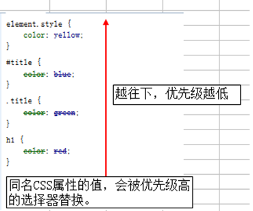

# 选择器

如上图所示，要把里面的小黄人分为2组，最快的方法怎么办？
方法很多，比如 一只眼睛的一组，剩下的一组

## 选择器的作用

找到特定的HTML页面元素
说人话？
选择标签用的，把我们想要的标签选择出来
css 就是 分两件事， 选对人，  做对事。

~~~css
h3 {
    color: red;
}
~~~

这段代码就是2件事， 把  h3选出来， 然后 把它变成了 红色。

## 学习内容

* 1. 选择器
  * 1.1 直接选择(基础选择器)
    * 1.1.1 标签选择器
    * 1.1.2 class选择器
    * 1.1.3 id选择器
  * 1.2 派生选择器(复合选择器)
    * 1.2.1 后代选择器
    * 1.2.2 子元素选择器
    * 1.2.3 相邻兄弟选择器
  * 1.3 分组选择
  * 1.4 属性选择
* 2. 伪类与伪元素
* 3. 继承与优先级

## 1.1 直接选择(基础选择器)

### 1.1.1 标签选择器

* 概念：
    标签选择器（元素选择器）是指用**HTML标签名**称作为选择器，按标签名称分类，为页面中某一类标签指定统一的CSS样式。
* 语法：

~~~css
标签名 {
    属性1:属性值1;  
    属性2:属性值2;  
    属性3:属性值3;  
}

h3 {
 color: red;
}
~~~

* 作用：
  标签选择器 可以把某一类标签**全部**选择出来  比如所有的div标签  和 所有的 span标签
* 优点：
  是能快速为页面中同类型的标签统一样式。
* 缺点：
  不能设计差异化样式。同一个标签大家都是统一的。

> 那，我只想选中几个标签该怎么呢

### 1.1.2 class选择器

* 概念：
  类选择器(class选择器)是指用HTML类名称作为选择器，按类名，为页面中某一类标签指定统一的CSS样式。  
* 语法：
  * 标签

  ~~~html
  

  ~~~
  
  * 类名选择器

  ~~~css
  .类名  {
      属性1:属性值1;  
      属性2:属性值2;  
      属性3:属性值3;
  }
  ~~~

* 优点：
  * 可以为元素对象定义单独或相同的样式。 可以选择一个或者多个标签  

* 注意
  * 类选择器使用“.”（英文点号）进行标识，后面紧跟类名(自定义，我们自己命名的)
  * 长名称或词组可以使用中横线来为选择器命名。
  * 不要纯数字、中文等命名，尽量使用英文字母来表示。

#### 案例

~~~html
  <head>
          <meta charset="utf-8">
          
      </head>
      <body>
        G
        o
        o
        g
        l
        e
      </body>
~~~

#### 特殊用法-多类名

我们可以给标签指定多个类名，从而达到更多的选择目的。

注意：

* 各个类名中间用空格隔开。
* 多类名选择器在后期布局比较复杂的情况下，还是较多使用的。

### 1.1.3 id选择器

id选择器使用`#`进行标识，后面紧跟id名

* 其基本语法格式如下：
  * 标签

  ~~~html
  

  ~~~

  * id选择器

  ~~~css
  #id名{
      属性1:属性值1;
      属性2:属性值2;
      属性3:属性值3;
  }
  ~~~

* 元素的id值是唯一的，只能对应于文档中某一个具体的元素。
* 用法基本和类选择器相同。

#### id选择器和类选择器区别

* W3C标准规定，在同一个页面内，不允许有相同名字的id对象出现，但是允许相同名字的class。

  * 类选择器（class） 好比人的名字，  是可以多次重复使用的， 比如  张伟  王伟  李伟  李娜
  * id选择器     好比人的身份证号码，  全中国是唯一的， 不得重复。 只能使用一次。

## 1.2 派生选择器(复合选择器)

### 1.2.1 后代选择器

* 概念
  后代选择器又称为包含选择器
* 作用
  用来选择元素的**子孙后代**
* 语法

~~~css
  父级 子级{
    属性:属性值;
    属性:属性值;
  }

  #class h3{
      color:red;
      font-size:16px;
  }
~~~

* 当标签发生嵌套时，内层标签就成为外层标签的后代。
* 子孙后代都可以这么选择。或者说，它能选择任何包含在内的标签。

### 1.2.2 子元素选择器

* 作用
  子元素选择器只能选择作为某元素**子元素(亲儿子)**的元素。
* 语法

~~~css
  父级>亲儿子{
    属性:属性值;
    属性:属性值;
  }
  #demo > h3{
    color:red;
    font-size:14px;
  }
~~~

> 强调:这里的子,指的是亲儿子 不包含孙子 重孙子之类.
上述实例中,`h3`一定是`#demo`的亲儿子 `#demo`包含`h3`

~~~html
  <head>
      <meta charset="UTF-8">
      
  </head>

  <body>
      

          <h3>我爱糯客</h3>
          

              
糯客爱我

          

      

  </body>
~~~

### 1.2.3 相邻兄弟选择器

* 作用
  相邻兄弟选择器（Adjacent sibling selector）可选择紧接在另一元素后的元素，且二者有相同父元素。
* 语法

~~~css
  元素+紧跟在后的元素{
    属性:属性值;
  }
  div+p{
    backgroung-color:yellow;
  }
~~~

~~~html
  <head>
    <meta charset="utf-8">
    
  </head>

  <body
      <h1>文章标题</h1>

      

          <h2>DIV 内部标题</h2>
          
DIV 内部段落。

      

      
DIV 之后的第一个 P 元素。

      
DIV 之后的第二个 P 元素。

  </body>
~~~

## 1.3 分组选择器

* 作用
  同时选取多个要设定相同样式的元素

~~~css
  h1{
      color:green;
  }
  h2{
      color:green;
  }
  p{
      color:green;
  }
~~~

* 语法

~~~css
  h1,h2,p
  {
     color:green;
  }
~~~

* demo

~~~html
<head>
    <meta charset="utf-8">
    
</head>

<body>
    <h1>Hello World!</h1>
    <h2>Smaller heading!</h2>
    
This is a paragraph.

</body>
~~~

## 1.4 [属性选择器]

* 作用
  难道编写前端代码只能通过`class`与`id`选择元素嘛?

### 1.4.1 属性选择器

下面的例子是把包含标题（title）的所有元素变为蓝色：

~~~css
[title] {
    color: blue;
}
~~~

~~~html
<head>
    
</head>

<body>
    <h2>Will apply to:</h2>
    <h1 title="Hello world">Hello world</h1>
    <a title="upc" href="//www.upc.edu.cn/">中国石油大学(华东)</a>
    

    <h2>Will not apply to:</h2>
    
Hello!

</body>
~~~

### 1.4.2 属性和值选择器

下面的实例改变了标题title='upc'元素的边框样式:
**用于选取属性值中包含指定词汇的元素。**

~~~css
[title=runoob] {
    border: 5px solid green;
}
~~~

~~~html
<head>
    <meta charset="utf-8">
    
</head>

<body>
    <h2>将适用:</h2>
     
    <a title="upc" href="//www.upc.edu.cn/">upc</a>
    

    <h2>将不适用:</h2>
    
Hi!

    <a class="fake_upc" href="//www.upc.edu.com/">upc</a>
</body>
~~~

### 1.4.3 属性和值选择器(多值)

* 下面是包含指定值的title属性的元素样式的例子，使用（~）分隔属性和值:

  ~~~css
  [title~=hello] {
      color:blue;
  }
  ~~~

  * demo

    ~~~html
    <head>
        <meta charset="utf-8">
        
    </head>

    <body>
        <h2>将适用:</h2>
        <h1 title="hello world">Hello world</h1>
        < title="student hello">Hello CSS students!</    p>
        

        <h2>将不适用:</h2>
        
Hi CSS students!

    </body>
    ~~~

* 下面是**带有**包含指定值的lang属性的元素样式的例子，使用（|）分隔属性和值:
**用于选取带有以指定值开头的属性值的元素，该值必须是整个单词。**

  ~~~css
  [lang|=en] {
      color:blue;
  }
  ~~~

  * demo

  ~~~html
  <head>
    <meta charset="utf-8">
    
  </head>

  <body>
      <h2>将适用:</h2>
      
Hello!

      
Hi!

      
Ello!

      

      <h2>将不适用:</h2>
      
Hi!

      
Hei!

  </body>
  ~~~

## 2. 伪类与为元素

* 作用：
  CSS 伪类用于向某些选择器添加特殊的效果。

* 语法

~~~css
  selector : pseudo-class {property: value}
~~~

* 常应用于链接
  在支持 CSS 的浏览器中，链接的不同状态都可以不同的方式显示，这些状态包括：活动状态，已被访问状态，未被访问状态，和鼠标悬停状态。

~~~css
 a:link {color: #FF0000}  /* 未访问的链接 */
 a:visited {color: #00FF00}  /* 已访问的链接 */
 a:hover {color: #FF00FF}  /* 鼠标移动到链接上 */
 a:active {color: #0000FF}  /* 选定的链接 */
~~~

* CSS 类也可与伪类搭配使用。

~~~css
  selector.class : pseudo-class {property: value}
  /* 比如 */
  a.red : visited {color: #FF0000}
  <a class="red" href="#">CSS Syntax</a>
~~~

假如上面的例子中的链接被访问过，那么它将显示为红色。

* 伪类

| 属性 |描述|
|----|----|
|:active|向被激活的元素添加样式。|
|:focus|向拥有键盘输入焦点的元素添加样式。|
|:hover|当鼠标悬浮在元素上方时，向元素添加样式。|
|:link|向未被访问的链接添加样式。|
|:visited|向已被访问的链接添加样式。|
|:first-child|向元素的第一个子元素添加样式。|
|:lang|向带有指定 lang 属性的元素添加样式。|

* 伪元素

| 属性 |描述|
|----|----|
|:first-letter|向文本的第一个字母添加特殊样式。|
|:forst-line|向文本的首行添加特殊样式。|
|:before|在元素之前添加内容。|
|:after|在元素之后添加内容。|

## 3. 继承与优先级

### CSS继承性

 CSS属性继承：外层元素的样式，会被内层元素进行继承。
  多个外层元素的样式，最终都会“叠加”到内层元素上。

* 什么样的CSS属性能被继承呢？
 CSS文本属性都会被继承的：
 color、 font-size、font-family、font-style、 font-weight
 text-align、text-decoration、text-indent、letter-spacing、line-height

> \<body>中的CSS属性，会被所有的子元素继承。

### CSS优先级

(1) 单个选择器的优先级
 行内样式 > id选择器 >  class选择器 > 标签选择器

(2) 多个选择器的优先级
多个选择器的优先级，一般情况下，指向越准确，优先级越高。
特殊情况下，我们需要假设一些值：

标签选择器      优先级为1
类选择器        优先级为10
Id选择器        优先级为100
行内样式        优先级为1000

计算以下优先级：

.news h1{color:red;}     优先级：10 + 1 = 11
.title{color:blue;}        优先级：10

div.news h1{color:red;}   优先级：1 + 10 + 1 = 12
h1.title{color:blue;}      优先级：1 + 10 = 11

作者[@Harrison-LUO][home]
2020 年 08月 21日

[属性选择器]:https://www.w3school.com.cn/css/css_syntax_attribute_selector.asp
[home]:https://github.com/Harrison-LUO
